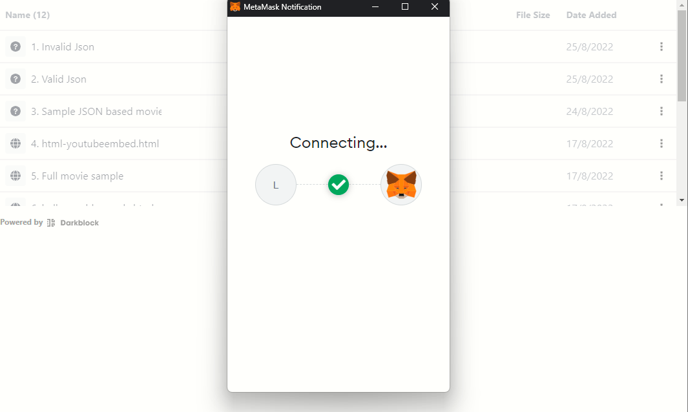
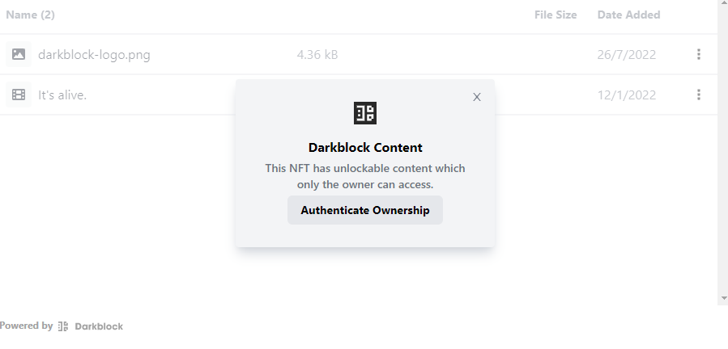

<h1>Next Ethereum</h1>
<h3>Hey Newbie &#128075;</h3>
<h4>Open this in preview mode for the best experience</h4>
<hr>
<h2>Intro:</h2>
<h3>We are going to clone a simple web app of nfts using Next and our Ethereum widget.</h3>
<h3>
<a href="https://nextjs.org/docs">Check out the Next documents here</a>and follow the open-source documentation to create and deploy your site along with the documentation we have provided.</h3><hr>
<h2>Clone</h2><br>
<ol>
<li>Go to your desktop and create a folder where you want your project to live. Open a new terminal, GitBash Here, or cmd.</li><br>
<li>Clone the repository:</li>
<br>

```
git clone gitRepo
```

<li>You should also install all the dependencies</li>
<br>

```
npm install or yarn install
```

</ol>
<hr>

<h2>How do you run your site locally?</h2>
<ol>
<li>In the command line, cd into the directory that you created. 
<h3>Ex.</h3>
<br>

```
cd my-next-app
```

<li>Run the command: </li><br>

```
yarn dev
```

or

```
npm run dev
```

<li>Go to your browser of choice and enter http:/localhost:8000 <a href="http://localhost:3000">Or click here</a></li>
</ol>
<hr>
<h2>Create .env file in the root of the project:</h2>

<h3>Create a file in the root of the project <strong>.env</strong> and put the following code:</h3>
NEXT_PUBLIC_REACT_APP_WALLET_ADDRESS=YourDefaultAddresHere //this is the default address with NFTs you want to see as a gallery
<br>
NEXT_PUBLIC_REACT_APP_USE_WALLET_ADDRESS=true //true if you want to use a wallet addres, false if you want to use a Json object

<h3>Restart your app and run</h3>
<br>

```
npm run dev
```

<h3>Refresh your page and you will need to log into your Ethereum wallet.</h3>
<br>

<br>

<h3>And now you have the <strong>Darkblock Ethereum Widget</strong> working!!!	&#x1f609; Congrats.</h3><br>

<br>

<h3>The whole code for this guide is in <a href="https://github.com/darkblockio/Starter-Ethereum-Nextjs">Github</a></h3>
